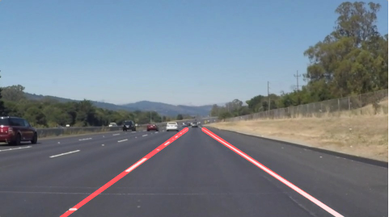

# **Finding Lane Lines on the Road** 

---

**Finding Lane Lines on the Road**

The goals / steps of this project are the following:
* Make a pipeline that finds lane lines on the road
* Reflect on your work in a written report

### Reflection

### 1. Describe your pipeline. As part of the description, explain how you modified the draw_lines() function.

The first step in my pipeline was to create a copy of the image to work with. I then applied a Gaussian blur filter to smoothen the image which improves my edge detection. I then converted the image to a grayscale and performed the Canny edge detection function on the image. Subsequently, I defined a region of interest as a quadrilateral that encompasses the lanes. Only the edges detected within this quadrilateral were used for my further processing. Finally I performed a Hough Transform on this region of interest to identify houghlines. The parameters for the Canny edge detection and the Hough Transform were tuned iteratively for optimal results. 

In order to draw a single line on the left and right lanes, I modified the draw_lines() function by first identifying the left and right lanes by the slope of the hough lines. Using the slope and the relative location of the Hough lines as segregating criteria, I polyfitted both sets of lines to calculate the parameters required to plot a single line. Finally single lines on either side were drawn across the entire masked region. 

Note: I have included all the ouput images for the sample images in the folder "./test_images_output/"

### 2. Identify potential shortcomings with your current pipeline

One potential shortcoming would be what would happen when both lanes fall on one side of the image frame (only left or only right hand side). This would render my segregation criteria to be ineffective and would throw off my polyfitting calculation.

### 3. Suggest possible improvements to your pipeline

A possible improvement would be to keep track of the average parameter (slope and imtercept) of the polyfitted lines to improve the steadiness of the lines and reduce erractic detection.
Another improvement would be to implement a time domain filter or a Kalman Filter for robustness.

